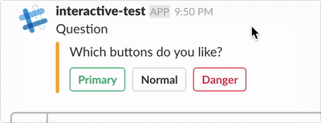

## node-slack-interactive-messages-sample

https://github.com/slackapi/node-slack-interactive-messages



- Create App
- Create Bot User
- Install App

```
$ cp .env-sample .env
$ vi .env
$ node main.js
$ ./ngrok http 3000
```

- Enable Interactive Components
- Settings https://*****.ngrok.com/slack for Request URL

```
$ curl https://*****.ngrok.com/auth/message -H "Authorization: Basic $(echo -n 'foobar:dolphins' | base64)"
```

## Article

[SlackのInteractive messagesでボタンの入力を受け付ける - sambaiz-net](https://www.sambaiz.net/article/148/)


